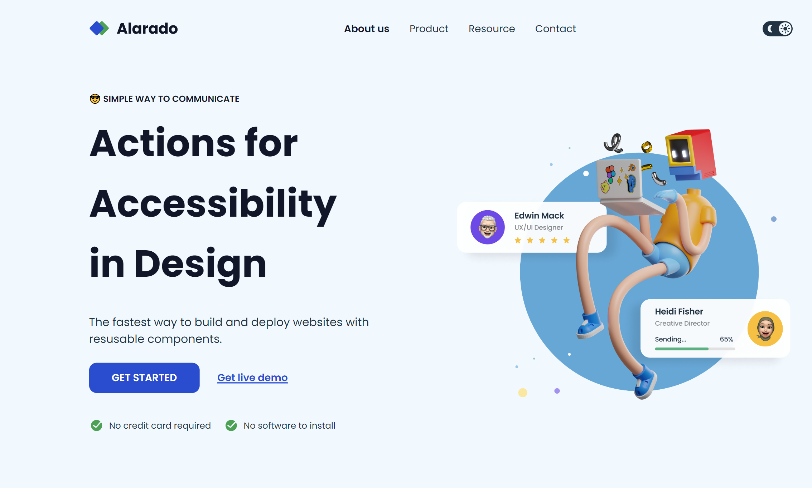
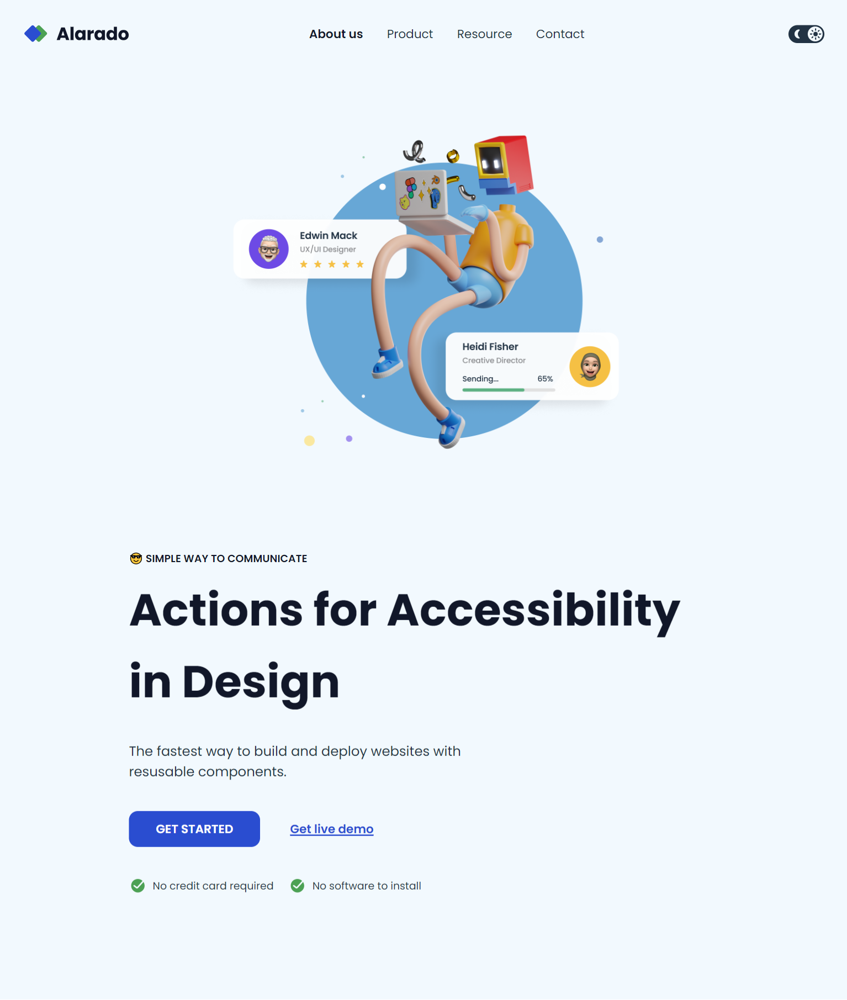
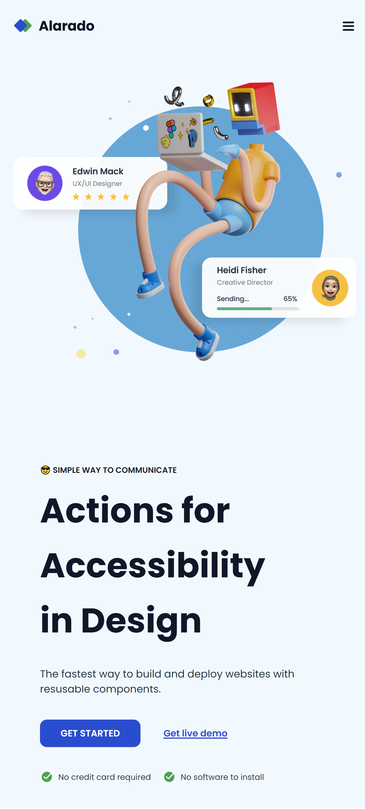
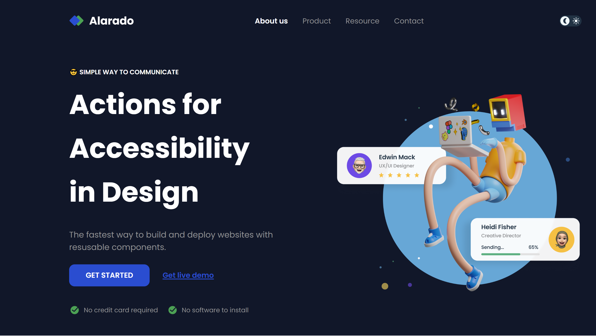
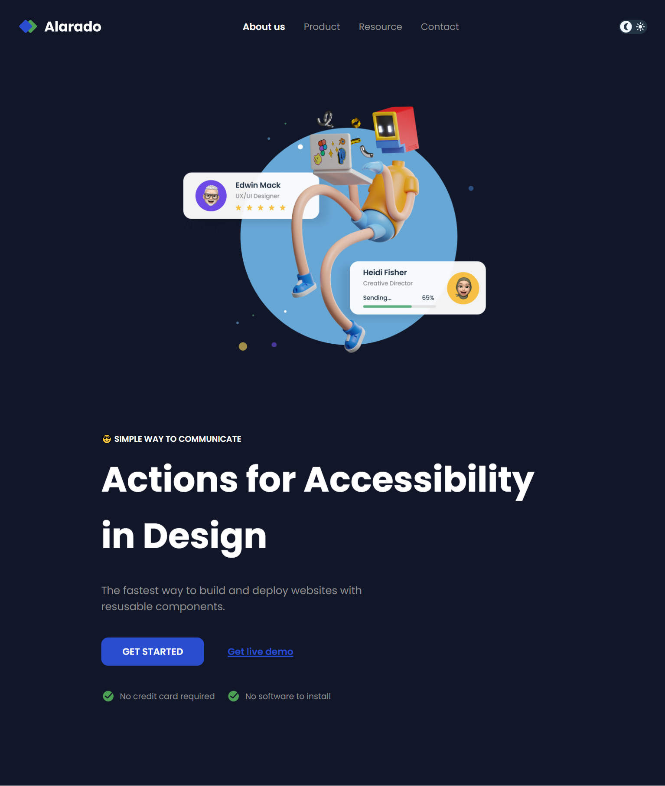
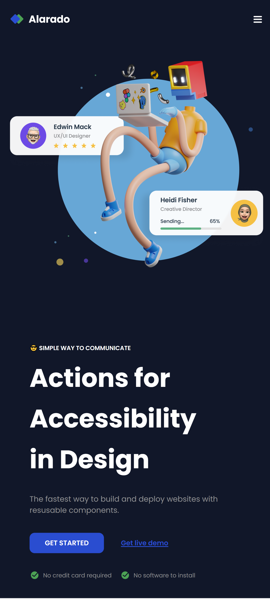
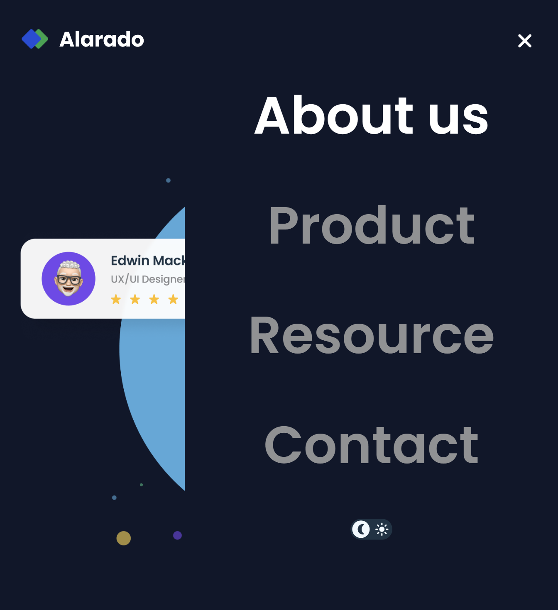

<!-- Please update value in the {}  -->

<h1 align="center">Simple Homepage - Alarado</h1>

<div align="center">
   Solution for a challenge from  <a href="http://devchallenges.io" target="_blank">Devchallenges.io</a>.
</div>

<div align="center">
  <h3>
    <a href="https://h-yoshikawa44.github.io/ch-simple-homepage-alarado/">
      Demo
    </a>
    <span> | </span>
    <a href="https://devchallenges.io/solution/6352">
      Solution
    </a>
    <span> | </span>
    <a href="https://devchallenges.io/challenge/simple-hompage-alarado">
      Challenge
    </a>
  </h3>
</div>

<!-- TABLE OF CONTENTS -->

## Table of Contents

- [Table of Contents](#table-of-contents)
- [Overview](#overview)
  - [Built With](#built-with)
- [Features](#features)
- [How To Use](#how-to-use)
- [learned/improved](#learnedimproved)
- [Acknowledgements](#acknowledgements)
- [Contact](#contact)

<!-- OVERVIEW -->

## Overview

<details>
  <summary>Light</summary>
    <h3>Desktop</h3>
    
    <h3>Tablet</h3>
    
    <h3>Mobile</h3>
    
    <h3>Mobile Menu</h3>
    
</details>

<details>
  <summary>Dark</summary>
    <h3>Desktop</h3>
    
    <h3>Tablet</h3>
    
    <h3>Mobile</h3>
    
    <h3>Mobile Menu</h3>
    
</details>

### Built With

<!-- This section should list any major frameworks that you built your project using. Here are a few examples.-->

Base

- [HTML](https://developer.mozilla.org/ja/docs/Web/HTML)
- [CSS](https://developer.mozilla.org/ja/docs/Web/CSS)
- [JavaScript](https://developer.mozilla.org/ja/docs/Web/JavaScript)
- [Node.js](https://nodejs.org/)：22.14.0
- [Vite](https://ja.vitejs.dev/)

Other major libraries

- [Lightning CSS](https://lightningcss.dev/)
- [wicg-inert](https://github.com/WICG/inert)

## Features

<!-- List the features of your application or follow the template. Don't share the figma file here :) -->

This application/site was created as a submission to a [DevChallenges](https://devchallenges.io/challenges) challenge. The [challenge](https://devchallenges.io/challenge/simple-hompage-alarado) was to build an application to complete the given user stories.

- [x] Create a simple homepage page that matches the given design.
- [x] Use HTML to create the basic structure.
- [x] Add logo, heading, description, links, buttons,.. according to the design.
- [x] User should be able to toggle between light and dark mode (light as default).
- [x] Use CSS or CSS frameworks to style the card.
- [x] The page should be responsive on different screen sizes.
- [x] On mobile, users should be able to toggle side navigation.

## How To Use

<!-- Example: -->

To clone and run this application, you'll need [Git](https://git-scm.com) and [Node.js](https://nodejs.org/en/download/) (which comes with [npm](https://www.npmjs.com/)) installed on your computer. From your command line:

```bash
# Clone this repository
git clone https://github.com/h-yoshikawa44/ch-simple-homepage-alarado.git
# or
git clone git@github.com:h-yoshikawa44/ch-simple-homepage-alarado.git

# Install dependencies
npm install

# Run the Vite
npm run dev
```

## learned/improved

- How to configure ESLint flat config.
- How to create a hamburger menu with accessibility in mind.
- How to implement theme switching functionality.
- Various methods to change SVG colors.
- Examples of :has.

## Acknowledgements

<!-- This section should list any articles or add-ons/plugins that helps you to complete the project. This is optional but it will help you in the future. For exmpale -->

- 開発環境
  - [ESLint - Configuration Migration Guide](https://eslint.org/docs/latest/use/configure/migration-guide)
  - [gitでtoo long unableが起きた時の解消法](https://zenn.dev/uyawer/articles/tech-20220523-git-too-long-unable)
- メニュー
  - [Vanilla JSでアクセシビリティを考慮したハンバーガーメニューをつくる](https://zenn.dev/h_ymt/articles/69b9ee1b43b14d)
- テーマ切り替え
  - [ON/OFFスイッチをCSSのみで実装](https://webparts.cman.jp/button/onoff/)
  - [CSS変数でテーマカラーを超絶簡単に変更する](https://pennn.me/css%E5%A4%89%E6%95%B0%E3%81%A7%E3%83%86%E3%83%BC%E3%83%9E%E3%82%AB%E3%83%A9%E3%83%BC%E3%82%92%E8%B6%85%E7%B5%B6%E7%B0%A1%E5%8D%98%E3%81%AB%E5%A4%89%E6%9B%B4%E3%81%99%E3%82%8B/)
- SVG 色変更
  - [「mask-image」でSVGアイコンの色をCSSで変えよう！　～mask-imageの便利な使い方紹介を添えて～](https://zenn.dev/kagan/articles/cf3332462262f1)
  - [SVGの色を変えたいときに試す4種の方法](https://ticketnote.dev/ticket/N1LsAm5SMGHV8GRrScyG)
  - [svgをuseタグで読み込んだ時にpath毎に色を変える方法（※IE以外）](https://oksho.net/html/svg-use-path-color-change/)
- その他
  - [【css】要素をposition:absoluteで中央に配置する最新の方法(上下左右、上下、左右)](https://arts-factory.net/position/)
  - [:focus-visible-within, the missing pseudo-class](https://larsmagnus.co/blog/focus-visible-within-the-missing-pseudo-class)

## Contact

- Website：[h-yoshikawa44.com](https://h-yoshikawa44.com)
- GitHub：[@h-yoshikawa44](https://github.com/h-yoshikawa44)
- Twitter：[@yoshi44_lion](https://twitter.com/yoshi44_lion)
